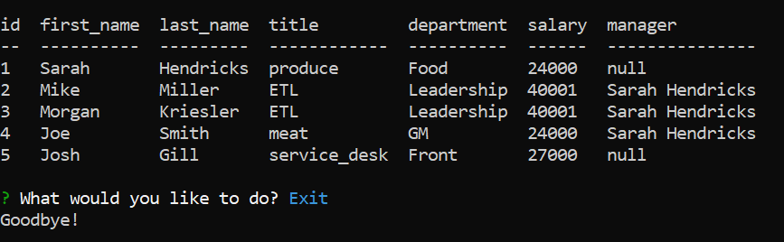

# My Team
## Description
My Team is an application that allows you to record your business's departments, roles, and employees through the command prompt into a mysql database. You can view, create, and edit the role of your employees.

## Installation
1. Clone the main branch from [GitHub](https://github.com/mimi5930/my-team)
2. Install the node package manager
```
npm install
```
3. Run the app in the terminal
```
node app.js
```
4. Create a **`pw.json`** file in the root directory
```json
{
    "SQL_U": "YOUR MYSQL USERNAME",
    "SQL_P": "YOUR MYSQL PASSWORD",
    "DB": "YOUR CHOSEN DATABASE"
}
```
## Usage
When you have created your team, first add your main deparments, roles, and employees. While adding employees, you will be asked to verify if they are a manager or not. You will be asked to add managers first, so keep that in mind when creating that first employee.

## Video Walkthrough
[](https://drive.google.com/file/d/1c0sV4lYE-nwnedJh5GFlObxzXNuJiNJq/view)

## Credits
This application uses the following packages:
* [Inquirer](https://github.com/SBoudrias/Inquirer.js#readme)
* [mysql2](https://github.com/sidorares/node-mysql2#readme)
* [console.table](https://github.com/bahmutov/console.table)

## Tests
An easy way to test this application would be through running the **`schema.sql`** and **`seeds.sql`** files located in the `db/` directory through the mysql terminal
1. Locate to the root directory in the terminal
```
~/my-team
```
2. log into mysql
```
mysql -u **** -p
```
3. Run the schema and seeds
```
SOURCE db/schema.sql;
SOURCE db/seeds.sql;
```
